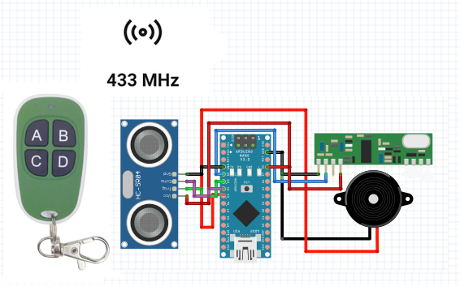

| Component                | Connection to Arduino Nano |
|--------------------------|----------------------------|
| **HC-SR04**                                           |
| Trig                     | D3                         |
| Echo                     | D4                         |
| VCC                      | 5V                         |
| GND                      | GND                        |
| **433MHz RX Module**                                  |
| Data                     | D2                         |
| VCC                      | 5V                         |
| GND                      | GND                        |
| **Buzzer**                                            |
| Red Wire                 | D5                         |
| Black Wire               | GND                        |
